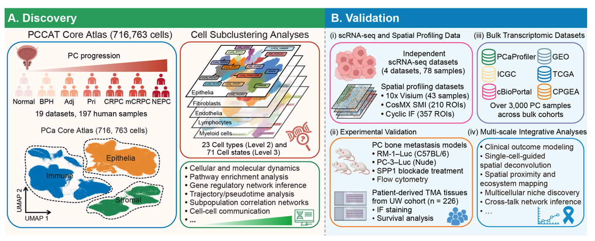

# Deciphering single-cell heterogeneity and cellular ecosystem dynamics during prostate cancer progression

## Abstract

High-resolution insights into how cellular phenotypes and multicellular ecosystems evolve during prostate cancer (PC) progression remain incomplete. Here, we present the Prostate Cancer Cell Atlas (PCCAT) and integrate it with spatial profiling to enable a multi-scale view of cellular programs and spatial niches. We map an epithelial continuum and identify lineage-plastic states associated with cancer invasion and metastatic spread. Advanced PC is marked by convergent immunosuppressive immune states, including dysfunctional T cell-states and SPP1⁺ macrophages. Notably, SPP1⁺ macrophages are strongly associated with bone metastasis, and functional SPP1 blockade restrains metastatic progression by reprogramming the tumor microenvironment. We further identify matrix cancer-associated fibroblasts (mCAFs) as a dominant stromal population expanded in advanced PC. Spatial integration reveals a transition toward stromal-enriched multicellular ecosystems, including a progression-associated mCAF-SPP1⁺ macrophage niche at the peritumoral interface of lineage-plastic tumors. Together, this study provides a high-resolution reference of PC ecosystems and defines cellular and spatial programs shaping disease progression.

## PCCAT website

We developed an interactive web portal called PCCAT (https://pccat.net) to maximize broad access to this PC atlas and provide an automated mapping tool enabling the rapid cell type annotation of cells from PC, including subtypes of neoplastic epithelium and components of the TME.

## Citation

**Deciphering single-cell heterogeneity and cellular ecosystem dynamics during prostate cancer progression**

Faming Zhao#, Han Zeng #, Jianming Zeng#, Canping Chen#, Xiaofan Zhao, Tingting Zhang, Kunlun Wang, Gulsu Sener, Jingui Liu, Julie N. Graff, George V. Thomas, Guan Fan, Rosalie C. Sears, Joshi J. Alumkal, Amy E. Moran, Gordon B. Mills, Sebnem Ece Eksi, Ji Zheng※, Peter S. Nelson※, Zheng Xia※. Deciphering single-cell heterogeneity and cellular ecosystem dynamics during prostate cancer progression. bioRxiv 2024.12.18.629070; doi: https://doi.org/10.1101/2024.12.18.629070

## Contact

Zheng Xia, PhD, Email: [xiaz@ohsu.edu](mailto:xiaz@ohsu.edu)

Department of Biomedical Engineering, Oregon Health & Science University, Portland, OR, USA. 

Any technical question please contact Faming Zhao (famingzhao@foxmail.com).

